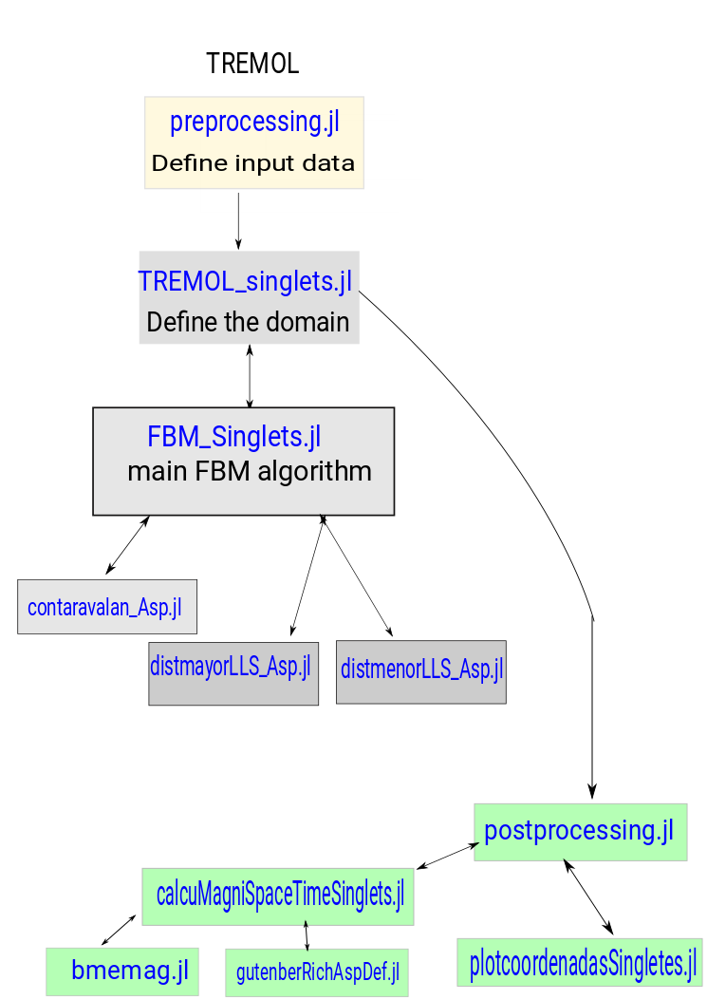

.. _Manual:

Manual
======

.. contents:: Table of contents
   :local:
   :backlinks: top

This manual provides reference documentation to TREMOL from a user’s and
developer's perspective.

.. _Coding style:

Coding style
------------

* 4 spaces per indentation level.
* float and integers are lower case meanwhile vectors and arrays are upper case.
* Comments convention for functions is as follows:

  .. code-block:: bash

    out1 = function(Arg1, arg2):
        """
          This is a function.
          
            Parameters
            - `Arg1:: Int`: array of dimensions ...
            - `arg2:: String`: string that ...
            return
            - `out1::Float`: float that ...            
        """

* The use of inline comments is sparingly and indicated with `#` symbol.

TREMOL_Singlets directory structure
***********************************

This subsection is dedicated to list and describe the TREMOL directory
structure.

.. list-table:: Top directory structure
   :widths: 10 90
   :header-rows: 1

   * - Name
     - Description
   * - `doc/`
     - Source files for TREMOL documentation
   * - `examples/`
     - Templates of basic scripts for TREMOL modelling
   * - `TREMOL_singlets/`
     - Source code
   * - `DESCRIPTION.rst`
     - Summary of TREMOL features and requirements 
   * - `LICENSE.rst`
     - License file
   * - `README.rst`
     - Readme file

The TREMOL source code is `TREMOL_singlets/`, which has the following contents:

.. list-table:: `TREMOL_singlets/` directory structure
   :widths: 10 90
   :header-rows: 1

   * - Name
     - Description
   * - `main/`
     - main scripts that carry out the simulation.
   * - `preprocessing/`
     - definition of the input parameters 
   * - `postprocessing/`
     - computation of results 

     
TREMOL workflow
***************

TREMOL work flow is described in `Figure 1`_. Pre-processing (yellow)
processing (gray) and post-processing (green) phases are included in `Figure 1`_.

.. _Figure 1:

   Figure 1. TREMOL: workflow diagram.
     
     
.. _Preprocessing-Manual:

.. _preprocessing:

TREMOL preprocessing  
=====================
The first step to use TREMOL code is the preprocessing file. Here we define the input parameters 
that will be used in the main algorithm to model a seismic asperity rupture.

This file is seen as follows:

.. _preprocessing.jl:

Arguments
-----------

  .. code-block:: julia

  #    Arguments
  
  # Parameters to assigned the initial conditions to the simulated domain 
  - `VecID ::String: Name to identify the simulated event.
  - `fhi_asp::Float`: percentage of load to be transferred for any ruptured cell in the asperity domain
  - `fhi_bkg::Float or Vector`: percentage of load to be transferred for any ruptured cell in the background
  - `strength_asp::Integer`: strength value to define the asperity cells.
  - `nbox::Integer`: Number of cells assigned to each Seismic Source.
  - `nk::Integer`: Number of times that will execute a same experiment to obtain statistics
  
  # Parameters coming from the finite fault source method
  - `DurTeo::Float Vector`: rupture duration given by finite fault computation [seconds]
  - `VelAsp :: Float Vector`: rupture velocity given by finite fault computation [km/s]
  - `Leff::Float Vector`: Effective length size of the effective rupture area [km]
  - `Weff::Float Vector`: Effective wide size of the effective rupture area [km]
  - `VectorSeff::Float Vector`: Effective area [km²]
  - `SaOri::Float Vector`: Ratio of the asperity size
  - `YsizeOri::Float Vector`: Asperity area [km²]
  

  # """

Include an external function
----------------------------

  include("TREMOL_singlets.jl")
  
  TREMOL_Singlets(VecID,fhi_asp,fhi_bkg,strength_asp,DurTeo,VelAsp,Leff,Weff,VectorSeff,SaOri,YsizeOri,nbox,nk)

  
.. _Running a simulation-Manual:

Running a simulation
--------------------

This section introduces the basics of running TREMOL on the command line. 
After introduce in preprocessing.jl script the values of the input arguments there are two options to execute TREMOL:

1. from a Linux bash run 

.. code-block:: bash
  
  $ julia YOURPATH/preprocessing.jl

This option do not allow to show the plots of the results produced in TREMOL_singlets.jl and in postprocessing.jl. However the plots and the result file will be save in the folder /PATH/TREMOL_singlets/Results

2. from a julia prompt

.. code-block:: julia

  include(joinpath("/YOURPATH/TREMOL_singlets/TREMOL_singlets/preprocessing/","preprocessing.jl"))
  
YOURPATH is the path where the code is saved and has to be defined in the `~/TREMOL_singlets/preprocessing.jl` script and also in `~/TREMOL_singlets/main/TREMOL_Singlets.jl script.

  
.. _ Visualization of results:

Visualization of results
------------------------

TREMOL generated plots and files as outputs. Plots are generated in four different functions of TREMOL, such as: TREMOL_singlets.jl, calcuMagniSpaceTimeSinglets.jl, plotcoordenadasSingletes.jl and gutenberRichAspDef.jl. 

* TREMOL_singlets.jl: generates the plot of the initial strength configuration in the total domain and in the asperity domain "EventoID*AsperezaSpatial.pdf"
* calcuMagniSpaceTimeSinglets.jl: generates three plots: 
 - the evolution of the generated Magnitude of the events function of Time "EventID-MagnitudeTime.pdf"
 - a histogram of the frequency magnitude of the simulated quakes "EventID-FrequencyMagnitude.pdf" 
 - rupture duration of each s:imulated earthquake "EventID-DurationFrequency.pdf"
* gutenberRichAspDef.jl: the cumulative number of earthquakes vs magnitude are generated for four different scale relations "EventID-GRfit.pdf"" 
* plotcoordenadasSingletes.jl: this function generates three plots
  - "EventID-Mean_Load.pdf": mean load value vs time since the simulation starts
  - "EventID-IntereventRate.pdf": the inter-event rate of the synthetic earthquakes
  - "EventID-SpatialDistribution.pdf": Final spatial distribution of the rupture groups shown in different colors each one.

These plots are save in the directory /PATH/TREMOL_singlets/Results_PlotsFiles. However all graphics can be deactivated by simply displaying a `#` symbol at the beginning of the line.
The plots "EventoID*AsperezaSpatial.pdf" and "EventID-SpatialDistribution.pdf" will be save only for the first realizations (i.e. nk=1)

The file "EventID-MagnitudeStatisticalResults.dat" contains in each column the follow information: 

  1. b-value computed trough the function bmemag.jl using Somerville relation
  2. maximum magnitude using Somerville relation
  3. b-value computed trough the function bmemag.jl using Mai relation
  4. maximum magnitude using Mai relation
  5. b-value computed trough the function bmemag.jl using Mai-VL relation
  6. maximum magnitude using Mai-VL relation
  7. b-value computed trough the function bmemag.jl using Ramirez relation
  8. maximum magnitude using Ramirez relation
  9. ratio of the largest simulated earthquake [cells] and the total number of cells
  10. largest simulated earthquake in [cells]
  11. the size  of the asperity defined in the random range
  12. the random number to define the size of the asperity size
  13. original asperity size coming from preprocessing input data
  14. number of steps realized in the algorithm
  15. maximum magnitude using Somerville relation
  16. length of the area earhquake (in km^2) divided by the rupture velocity (km/s). 
  17. equivalent rupture time in seconds, considering the longest length divided by the rupture velocity
  18. equivalent rupture time in seconds considering the root square of the area divided by the rupture velocity
  19. rupture velocity, velAsp
  20.area of the largest simulated earthquake
  21. sqrt(area of the largest simulated earthquake)/velAsp
  22.sqrt(area of the largest simulated earthquake)/DurTeo
  23. velAsp*DurTeo
  24. sqrt(area of the largest simulated earthquake)/velAsp 

Each row corresponds to one execution controlled by the number `nk`.
Using the output file "EventID-MagnitudeStatisticalResults.dat") you can realize the corresponding statistics analyzing the ruptured area or the equivalen magnitude computed with four different scale-realtions.

.. _Examples:

Examples
--------

This section includes two examples using different input values in order to show how configure TREMOL.
In the examples cases is requiered to modify your path directory `YOURPATH` only in the script YOURPATH/TREMOL_singlets/examples/ExampleMw7_0-1982/TREMOL_Singlets.jl and YOURPATH/TREMOL_singlets/examples/ExampleMw8_2-2017/TREMOL_Singlets.jl

Example 1: Modelling the magnitude and ruptured area of the earthquake Mw=7.0, 07/06/1982
*****************************************************************************************

To run this example is requiered to executed the following command in the bash

.. code-block:: bash

  $ julia YOURPATH/TREMOL_singlets/examples/ExampleMw7_0-1982/preprocessing.jl

The input value described in the `YOURPATH/TREMOL_singlets/examples/ExampleMw7_0-1982/preprocessing.jl` file are:

VecID =  ["Mw7-1982"]  
fhi_bkg =  0.67
fhi_asp =  0.90
strength_asp = 4
nbox = 100
nk = 10
DurTeo = [40] 
VelAsp = [3.2]
Leff = [34.47] 
Weff = [17.81]   
VectorSeff = [Leff[1].*Weff[1]]   
SaOri = [0.23]
YsizeOri = [Leff[1].*Weff[1].*SaOri[1]] 

The values of: DurTeo, VelAsp, SaOri, Leff and Weff are computed from slip models (Rodríguez-Pérez & Ottemöller, 2013). While fhi_bkg, fhi_asp, strength_asp, nbox, come from TREMOL model and empirical results. 
The number of times that the model is executed to realize statistics is defined by nk value.
The output plot and file that can be used to realize statistics over the mean magnitude and rupture area are saved in the folder `/YOURPATH/TREMOL_singlets/examples/ExampleMw7_0-1982/Results_PlotsFilesMw7_1982/`

Example 1: Modelling the magnitude and ruptured area of the earthquake Mw=8.2, 08/09/2017
*****************************************************************************************

To run this example is requiered to executed the following command in the bash

.. code-block:: bash

  $ julia YOURPATH/TREMOL_singlets/examples/ExampleMw8_2-2017/preprocessing.jl

The input value described in the `YOURPATH/TREMOL_singlets/examples/ExampleMw8_2-2017/preprocessing.jl` file are:

VecID =  ["EventMw8_2"]  
fhi_bkg =  0.67
fhi_asp =  0.90
strength_asp = 4
nbox = 100
nk = 1
DurTeo = [40] 
VelAsp = [2.0]
Leff = [125.95] 
Weff = [71.13]   
VectorSeff = [Leff[1].*Weff[1]]   
SaOri = [0.34]
YsizeOri = [Leff[1].*Weff[1].*SaOri[1]] 

.. _Code documentation:

Code documentation
------------------

Following sub-sections are dedicated to code documentation of TREMOL.

.. _install:

.. _preprocessing:

TREMOL preprocessing  
********************

Define the input parameters defined arguments 

preprocessing.jl
----------------
Define the input values and its functions and pass it to the TREMOL_main.jl script

Import modules
   using PyPlot
   using PyCall
   @pyimport matplotlib.colors as matcolors
   @pyimport matplotlib as mpl
   @pyimport matplotlib.patches as patches

Import functions
  - include(joinpath("/YOURPATH/TREMOL_singlets/main/","TREMOL_Singlets.jl"))
  

Parameters

# Parameters to assigned the initial conditions to the simulated domain 
  - `VecID ::String: Name to identify the simulated event.
  - `fhi_asp::Float`: percentage of load to be transferred for any ruptured cell in the asperity domain
  - `fhi_bkg::Float or Vector`: percentage of load to be transferred for any ruptured cell in the background
  - `strength_asp::Integer`: strength value to define the asperity cells.
  - `nbox::Integer`: Number of cells assigned to each Seismic Source.
  - `nk::Integer`: Number of times that will execute a same experiment to obtain statistics
  
# Parameters coming from the finite fault source method
  - `DurTeo::Float Vector`: rupture duration given by finite fault computation [seconds]
  - `VelAsp :: Float Vector`: rupture velocity given by finite fault computation [km/s]
  - `Leff::Float Vector`: Effective length size of the effective rupture area [km]
  - `Weff::Float Vector`: Effective wide size of the effective rupture area [km]
  - `VectorSeff::Float Vector`: Effective area [km²]
  - `SaOri::Float Vector`: Ratio of the asperity size
  - `YsizeOri::Float Vector`: Asperity area [km²]
  

Main
****

TREMOL_Singlets.jl 
------------------
Main program that assigns the size and shape to the effective domain and asperity domain. Also this script gives the input values to the FBM algorithm. Lastly the output values goes to the postprocess function.

Import functions
  - include(joinpath("/YOURPATH/TREMOL_singlets/main/","FBM_Singlets.jl"))
  - include(joinpath("/YOURPATH/TREMOL_singlets/postprocessing/","postprocessing.jl"))

Parameters
- `VecID::String`: Name to identify the simulated event.
- `fhi_asp::Float`: percentage of load to be transferred for any ruptured cell in the asperity domain
- `fhi_bkg::Float or Vector`: percentage of load to be transferred for any ruptured cell in the background
- `strength_asp::Integer`: strength value to define the asperity cells.
- `DurTeo::Float Vector`: rupture duration given by finite fault computation [seconds]
- `VelAsp :: Float Vector`: rupture velocity given by finite fault computation [km/s]
- `Leff::Float Vector`: Effective length size of the effective rupture area [km]
- `Weff::Float Vector`: Effective wide size of the effective rupture area [km]
- `VectorSeff::Float Vector`: Effective area [km²]
- `SaOri::Float Vector`: Ratio of the asperity size
- `YsizeOri::Float Vector`: Asperity area [km²]
- `nbox::Integer`: Number of cells assigned to each Seismic Source.
- `nk::Integer`: Number of times that will execute a same experiment to obtain statistics

return 
- `VecMagni::Vector`: Array that contains the results of the magnitude analysis coming from the function postprocessing.jl

FBM_Singlets.jl 
---------------

This function carry out the FBM asperity algorithm 

Import function
 - include(joinpath("/YOURPATH/TREMOL_singlets/main/","contaravalan_Asp.jl"))
 - include(joinpath("/YOURPATH/TREMOL_singlets/main/","distmayorLLS_Asp.jl"))  
 - include(joinpath("/YOURPATH/TREMOL_singlets/main/","distmenorLLS_Asp.jl"))

Parameters
- `nbox_x::Integer`: number of cells in X-axis of the domain  \Omega
- `nbox_y::Integer`: number of cells in Y-axis of the domain \Omega 
- `smin::Integer`: number of steps that realize the algorithm 
- `VecPosi::Array`: size(nbox_x,nbox_y), Matrix of the load values. Dynamical matrix because changes the value of some cells at each step. 
- `MatrizStrengtInitial::Array`: size(nbox_x,nbox_y), Initial Matrix of the strength value.
- `VecAsperi::Array`: size(nbox_x,nbox_y), Matrix of the strength value.  This matrix evolves at each step 
- `fhiFuera::Float`: load-transfer value assigned to the cells located in the domain
- `fhiDentro::Float`: load-transfer value assigned to the cells located in the asperity domain  
- `VecPhi::Array`: size(nbox_x,nbox_y), Matrix of the load-tranfer values.

return

- `vectk1::Array`: size(smin+10,12). Raw data that contains the results of the transfer, accumulation and rupture process following the FBM rules. At each step   each row contains: 
     1. k:number of step
     2. acumt: cumulative time (T_k = sum(tiempo[1:k]))
     3. tiempo[k]: inter-event time [dimensionless]
     4. (0 or 1): counter that indicates if is normal or avalanche event
     5. suma: sum of the load in all the cells
     6. sumarho= 1/tiempo[k]  (rupture rate)
     7. parametrosigma: load value of the cell chosen to fail
     8. a: coordinate in the X-axis, of the cell chosen to fail
     9. b: coordinate in the Y-axis, of the cell chosen to fail
     10. fhi: load-transfer value
     11-12. (iorigi,jorigi): coordinates of the cell chosen to fail at the first stage of the searching algortithm defined in the function contaravalan_Asp. 
- `vectparamestad::Array`:  size(smin+10,2). Mean and Standard deviation of the load in the system, computed at each time step considering only the cells active 
- `VecPosiFinal::Array`: size(nbox_x,nbox_y). Final configuration of VecPosi.

contaravalan_Asp.jl 
-------------------
Compute the number of cells that overpass the threshold load value (STAGE 1). But also in this version the cells that fails is choosen considering not only its load but also the strength criterion defined in TREMOL algorithm (STAGE 2)

Parameters

- `nx::Integer`: number of cells in X-axis of the domain  \Omega
- `ny::Integer`: number of cells in Y-axis of the domain \Omega 
- `VectorP::Array`: size(nbox_x,nbox_y), Matrix of the load values. Dynamical matrix because changes the value of some cells at each step. 
- `VecAsperi::Array`: size(nbox_x,nbox_y), Matrix of the strength value.  This matrix evolves at each step 
- `VecPhi:Array`: size(nbox_x,nbox_y), Matrix of the load-tranfer values.
- `rho::Integer`: Weibull exponent, we take it as a constant 30
- `k::Integer`: step  of number

return

- `contador::Integer`: number of cells that overpass the threshold load value
- `Nflag1::Integer` : code that indicates if the rupture is normal or avalanche 
- `maxtempo1::Float` : maximum load value
- `iout1::Integer`: x coordinate in the array of the chosen cell to fail
- `jout1::Integer`: y coordinate in the array of the chosen cell to fail
- `VecAsperi::Array`: updated matrix of the strength
- `iout::Integer`: x coordinate in the array of the chosen cell to fail at STAGE 1
- `jout::Integer`: Y coordinate in the array of the chosen cell to fail at STAGE 1

distmayorLLS_Asp.jl
-------------------

Function that distribute the load following the avalanche events algorithm (avalanche event is the cell that overpass their threshold values)

Import function
 - include(joinpath("/YOURPATH/TREMOL_singlets/main/","vecinosLLS.jl"))

Parameters

- `vector::Array`:vector of nine positions that contains the neighbors and failed cell, being:   vector[9], vector[3], vector[7] and vector[1] diagonal neighbors; vector[8], vector[2], vector[4] and vector[6] perpendicular neighbors. Finally vector[5] is the failed cell.     
- `fhi::Float`: load-transfer value assigned to the failed cell. 

return 

- `vector::Array`: updated vector of nine positions after the load transfer of the failed cell.

distmenorLLS_Asp.jl
-------------------

Function that distributes the load following the normal-events algorithm (when any cell ooverpass their threshold values)

Import function
 - include(joinpath("/YOURPATH/TREMOL_singlets/main/","vecinosLLS.jl"))
 
Parameters
- `vector1::Array`:vector of nine positions that contains the neighbors and failed cell, being:   vector1[9], vector1[3], vector1[7] and vector1[1] diagonal neighbors; vector1[8], vector1[2], vector1[4] and vector1[6] perpendicular neighbors. Finally vector1[5] is the failed cell.     
- `fhi::Float`: load-transfer value assigned to the failed cell 

return 

- `vecreload::Array`: updated vector of nine positions after the load transfer of the failed cell.

vecinosLLS.jl
-------------

This function distributed the load for the orthogonal neigbors (N,S,E,W) that are allowed to received load. 

Import function
 - include(joinpath("/YOURPATH/TREMOL_singlets/main/","veciProhiDiag.jl"))

Parameters
- `vector::Array`:vector of nine positions that contains the neighbors and failed cell, being:   vector[9], vector[3], vector[7] and vector[1] diagonal neighbors; vector[8], vector[2], vector[4] and vector[6] perpendicular neighbors.
- `vecEsfTot::Float`: Load value of the failed cell.    

return 
- `vectclon::Array`: Updated vector of nine positions after the load transfer of the failed cell.

veciProhiDiag.jl
----------------

Compute the number of cells that overpass the threshold load value. But also in this version it choose the cells that is ruptured because the strength criterion defined in TREMOL algorithm

Parameters

- `vector::Array`:vector of nine positions that contains the neighbors and failed cell, being:   vector[9], vector[3], vector[7] and vector[1] diagonal neighbors; vector[8], vector[2], vector[4] and vector[6] perpendicular neighbors.`
- `vecEsfDiag::Float`: Load value will be transfer to the Diagonal neighbors. `
- `A::Array`:vector of four positions that contains the diagonal neighbors

return
- `B::Array`: updated vector of four positions that contains the new amount of load given to the diagonal neighbors

Post-processing
***************

postprocessing.jl
-----------------

Main program that assigns the size and shape to the effective domain and asperity domain. Also this script gives the input values to the FBM algorithm. Lastly the output values goes to the postprocess function.

Import function
  - include(joinpath("/YOURPATH/TREMOL_singlets/main/","calcuMagniSpaceTimeMultiSinglets.jl"))
  - include(joinpath("/YOURPATH/TREMOL_singlets/postprocessing/","plotcoordenadasSingletesbis.jl"))

Parameters

- `datos::Array`: size(smin,12) raw data coming from the FBM algorithm. This data base contains the rupture information of model  
 Each row contains: 
    1. k:number of step
    2. acumt: tiempo acumulado (T_k = sum(tiempo[1:k]))
    3. tiempo[k]: inter-event time [dimensionless]
    4. (0 or 1): identifier to normal or avalanche event
    5. suma: sum of the load in all the cells
    6. sumarho= 1/tiempo[k]  (rupture rate)
    7. parametrosigma: load value of the cell chosen to fail
    8. a: coordinate in the X-axis, of the cell chosen to fail
    9. b: coordinate in the Y-axis, of the cell chosen to fail
    10. fhi: load-transfer value
    11-12. (iorigi,jorigi): coordinates of the cell chosen to fail at the first stage of the searching algortithm defined in the function contaravalan_Asp. 
    
- `VectorCenterAperities::Vector Integer`: size(1), Central coordinates of the aspertity (x,y)
- `VectorSaOriLateralSize_y::Vector`: Asperity lateral size in the Y-axis
- `VectorSaOriLateralSize_x::Vector`: Asperity lateral size in the X-axis
- `VectorCoordsAperities_x::Vector Integer`: coordinates of the asperity vertex in the X-axis
- `VectorCoordsAperities_y::Vector Integer`: coordinates of the asperity vertex in the Y-axis 
- `nbox_x::Integer`: number of cells in X-axis of the domain  \Omega
- `nbox_y::Integer`: number of cells in Y-axis of the domain \Omega 
- `smin::Integer`: number of steps that realize the algorithm 
- `vecEstadistico::Array`:  size(smin+10,2). Mean and Standard deviation of the load in the system, computed at each time step considering only the cells active
- `VectorSaOri::Float Vector`: Random size  of the asperity 
- `SaOri::Float Vector`: Original Ratio of the asperity size
- `TotalNumberCells::Integer`: number of cells in the domain \Omega (nbox_x * nbox_y)
- `a::Float`: random number
- `CellSize::Float`: Size of a cell in km²
- `velAsp::Float`: rupture velocity
- `Weff::Float`: width of the effective area in km 
- `Leff::Float`: length of the effective area in km 
- `DurTeo::Float`: rupture duration

return

- `vecMagniLoop::Array`: results of tha magnitude analysis 
  Each row contains: 
   1. vecMagniLoop[1,1]: b-value computed trough the function bmemag.jl using Somerville relation
   2. vecMagniLoop[1,2]: maximum magnitude using Somerville relation
   3. vecMagniLoop[1,3]: b-value computed trough the function bmemag.jl using Mai relation
   4. vecMagniLoop[1,4]: maximum magnitude using Mai relation
   5. vecMagniLoop[1,5]: b-value computed trough the function bmemag.jl using Mai-VL relation
   6. vecMagniLoop[1,6]: maximum magnitude using Mai-VL relation
   7. vecMagniLoop[1,7]: b-value computed trough the function bmemag.jl using Ramirez relation
   8. vecMagniLoop[1,8]: maximum magnitude using Ramirez relation
   9. vecMagniLoop[1,9]: ratio of the largest simulated earthquake [cells] and the total number of cells
   10. vecMagniLoop[1,10]: largest simulated earthquake in [cells]
   11. vecMagniLoop[1,11]: VectorSaOri
   12. vecMagniLoop[1,12]: a
   13. vecMagniLoop[1,13]: SaOri
   14. vecMagniLoop[1,14]: smin
   15. vecMagniLoop[1,15]: maximum magnitude using Somerville relation
   16. vecMagniLoop[1,16]: length of the area earhquake (in km^2) divided by the rupture velocity (km/s) 
   17. vecMagniLoop[1,17]: equivalent rupture time in seconds, considering the longest length divided by  the rupture velocity
   18. vecMagniLoop[1,18]: equivalent rupture time in seconds considering the root square of the area divided by the rupture velocity
   19. vecMagniLoop[1,19]: rupture velocity, velAsp
   20. vecMagniLoop[1,20]: area of the largest simulated earthquake
   21. vecMagniLoop[1,21]: sqrt(area of the largest simulated earthquake)/velAsp
   22. vecMagniLoop[1,22]: sqrt(area of the largest simulated earthquake)/DurTeo
   23. vecMagniLoop[1,23]: velAsp*DurTeo
   24. vecMagniLoop[1,24]: sqrt(area of the largest simulated earthquake)/velAsp 
   
   
calcuMagniSpaceTimeSinglets.jl
------------------------------

Cluster the avalanches considering the time and space criterion. Also is computed the equivalent magnitude at each new group. 

Import function
- include(joinpath("/YOURPATH/TREMOL_singlets/postprocessing/","gutenberRichAspDef.jl"))
- include(joinpath("/YOURPATH/TREMOL_singlets/postprocessing/","bmemag.jl"))

Parameters
- `Y::Array`:raw data coming from the FBM algorithm. This data base contains the rupture information of model  
  Each row contains: 
    1. k:number of step
    2. acumt: tiempo acumulado (T_k = sum(tiempo[1:k]))
    3. tiempo[k]: inter-event time [dimensionless]
    4. (0 or 1): identifier to normal or avalanche event
    5. suma: sum of the load in all the cells
    6. sumarho= 1/tiempo[k]  (rupture rate)
    7. parametrosigma: load value of the cell chosen to fail
    8. a: coordinate in the X-axis, of the cell chosen to fail
    9. b: coordinate in the Y-axis, of the cell chosen to fail
    10. fhi: load-transfer value
    11-12. (iorigi,jorigi): coordinates of the cell chosen to fail at the first stage of the searching algortithm defined in the function contaravalan_Asp. 
    
- `Nbox_x::Integer`: number of cells in X-axis of the domain \Omega
- `Nbox_y::Integer`: number of cells in Y-axis of the domain \Omega`
- `smin::Integer`: number of steps that realize the algorithm 
- `VectorCenterAperities::Vector Integer`: size(1), Central coordinates of the aspertity (x,y)
- `VectorSaOriLateralSize_y::Vector`: Asperity lateral size in the Y-axis
- `VectorSaOriLateralSize_x::Vector`: Asperity lateral size in the X-axis
- `VectorCoordsAperities_x::Vector Integer`: coordinates of the asperity vertex in the X-axis
- `VectorCoordsAperities_y::Vector Integer`: coordinates of the asperity vertex in the Y-axis 
- `CellSize::Float`: Size of a cell in km²`
- `velAsp::Float`: rupture velocity
- `Weff::Float`: width of the effective area in km 
- `Leff::Float`: length of the effective area in km 

return 
- `vecMagni::Array`: matrix that contains the results of the magnitude analysis
- VecNewAvalSpaceTime::Array`: matrix that contains the data of the regrouping algorithm coming from the Y matrix  
 Each row contains: 
 1. VecNewAvalSpaceTime[contNumAvalSpaceTime,1] = contadorAval: number of elements considering in the  
                                                   regrouping algorithm
 2. VecNewAvalSpaceTime[contNumAvalSpaceTime,2] = original number in the raw catalog Y
 3. VecNewAvalSpaceTime[contNumAvalSpaceTime,3] = cumulative time (T_k = sum(tiempo[1:k])) computed in 
                                                   the raw catalog Y
 4. VecNewAvalSpaceTime[contNumAvalSpaceTime,4] = inter-event time [dimensionless] computed in the raw
                                                   catalog Y
 5. VecNewAvalSpaceTime[contNumAvalSpaceTime,5] = normal-avalanche code considered in the new regrouping
 6. VecNewAvalSpaceTime[contNumAvalSpaceTime,6] = x coordinate
 7. VecNewAvalSpaceTime[contNumAvalSpaceTime,7] = y coordinate
 8. VecNewAvalSpaceTime[contNumAvalSpaceTime,8] = rupture rate  

bmemag.jl
---------

Function calculates the mean magnitute, the b value based on the mean and the standart deviation 

Parameters
- `VecMag ::Array`: Vector that contains the equivalent magnitudes

return
- `meanm1::Float`: mean value of VecMag vector
- `b1::Float`: b-value 
- `sig1::Float`: standard deviation
- `av2::Float`: a-value

gutenberRichAspDef.jl
---------------------

Function that computes the Gutenberg-Richter fit relation using the method of least squares 
 
Parameters
- `VecMagHB1::Array`: Vector that contains the equivalent magnitudes
- `nflag::Integer`: Identifier
- `AreaSUB::Float`: Cell area ion km²

return
- `paramGRAreaWY::Array`: results of the Gutenber-Richter fitting using the least square method
  1. paramGRAreaWY[1]=magMax
  2. paramGRAreaWY[2]=magMin
  3. paramGRAreaWY[3]=p1 (a-value)
  4. paramGRAreaWY[4]=p2 (b-value)
  5. paramGRAreaWY[5]=rho (correlation coeficient)
- `cuenrep::Integer`: number of times that a same frequency of magnitudes is repeated for different magnitudes  
- `vecWrite::Array`: vector that contains the frequency-magnitude data.

